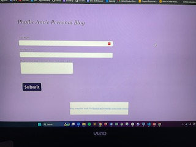
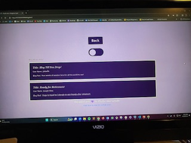
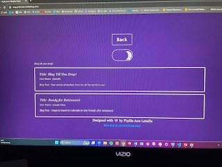

# Phyllis-Ann-Personal-Blog

## Description

A personal blog page with light/dark mode and a back button that allows users to read and write blog posts through a user interface that collects the user's username, blog post title and their blog posts.

- Motivation: I felt that type of page is a useful tool for communicating ideas and networking with others with similar interests.
- Why did you build this project? Building this blog page was an educational experience, both in learning how to code such a document, but also in learning about the benefits of having a blog page.
- What problem does it solve? My personal blog can connect me with other web developers, who I can learn from and consult when I have a problem I'm uncertain of the resolution.
- What did you learn? I learned about blogging, as well as how to write JavaScript functions to insert html code into a document when a user posts a comment, and to manage styling on a Bootstrap framework.

## Installation

When a user opens the landing page, they find a user interface form to complete with their blog title, user name, and their blog comment. If they fail to complete all the items on the form before clicking on the submit button, they receive an alert instructing them to complete the form in order to post their comment. When the form is properly completed clicking on the submit button will bring them to the blog page where their blog post has been added to an array of blog posts, which they can read and respond to. Once on the blog page, a user can toggle from light mode to dark mode or click on the back button to leave another blog post.

## Usage

1. When the landing page has loaded, complete the form fields provided to enter your user name, blog title, and blog comment.

2. Click the submit button to post your comment and you will be directed to the blog page, where you can review your post and others.

3. Once you are directed to the blog page, you can select day or night mode by toggling the oval-shaped button in the header.

4. If you would like to leave another comment after reviewing the existing blog posts, click the back button at the top of the page and repeat these instuctions.

Please click the links below for screen shots of these pages:

    ```md
    
    ```
    ```md
    
    ```
    ```md
    
    ```

## Credits

I collaborated with Melissa Cade, Dennis Itua, Brandon Leek, and Benjamin Machock.

I consulted Bootstrap Docs for best use and for troubleshooting of the styling for my html frameworks, the user input form on index.html, and the card on blog.html. For more information please see the following links:

    https://getbootstrap.com/docs/5.3/layout/containers/
    https://getbootstrap.com/docs/5.3/forms/overview/#overview
    https://getbootstrap.com/docs/5.3/components/card/

I reviewed the following MDN web docs for best use of the JavaScript methods, functions, and syntax needed for my form.js and blog.js:

    https://developer.mozilla.org/en-US/docs/Web/JavaScript/Reference/Global_Objects/Function
    https://developer.mozilla.org/en-US/docs/Web/API/EventTarget/addEventListener
    https://developer.mozilla.org/en-US/docs/Web/API/Document/querySelector
    https://developer.mozilla.org/en-US/docs/Web/API/Document/getElementById
    https://developer.mozilla.org/en-US/docs/Web/API/Window/localStorage
    https://developer.mozilla.org/en-US/docs/Web/API/Storage/setItem
    https://developer.mozilla.org/en-US/docs/Web/JavaScript/Reference/Global_Objects/JSON

I used Creative Dark Mode Switch by UI in this project.

## License

MIT License

Copyright (c) 2024 Phyllis Ann Lataille

Permission is hereby granted, free of charge, to any person obtaining a copy
of this software and associated documentation files (the "Software"), to deal
in the Software without restriction, including without limitation the rights
to use, copy, modify, merge, publish, distribute, sublicense, and/or sell
copies of the Software, and to permit persons to whom the Software is
furnished to do so, subject to the following conditions:

The above copyright notice and this permission notice shall be included in all
copies or substantial portions of the Software.

THE SOFTWARE IS PROVIDED "AS IS", WITHOUT WARRANTY OF ANY KIND, EXPRESS OR
IMPLIED, INCLUDING BUT NOT LIMITED TO THE WARRANTIES OF MERCHANTABILITY,
FITNESS FOR A PARTICULAR PURPOSE AND NONINFRINGEMENT. IN NO EVENT SHALL THE
AUTHORS OR COPYRIGHT HOLDERS BE LIABLE FOR ANY CLAIM, DAMAGES OR OTHER
LIABILITY, WHETHER IN AN ACTION OF CONTRACT, TORT OR OTHERWISE, ARISING FROM,
OUT OF OR IN CONNECTION WITH THE SOFTWARE OR THE USE OR OTHER DEALINGS IN THE
SOFTWARE.
